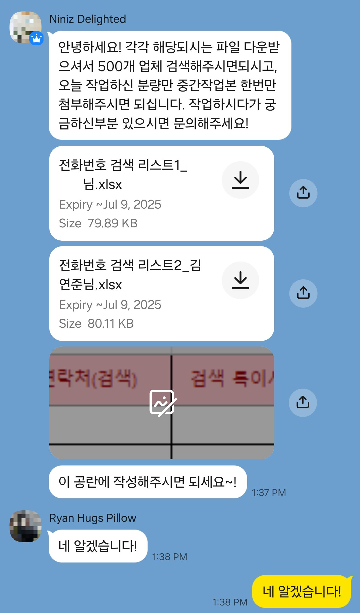

# Semi-Automated Web Crawler

아르바이트 중 반복적으로 수행하던 외식·프랜차이즈 업체의 대표전화 조사 업무를 줄이기 위해 만든 Selenium 기반 반자동화 도구입니다.

당시 실제 업무에서 사용했던 `original.py`와, 이후 다시 코드를 검토하며 현재 관점에서 구조와 안정성을 개선한 `improved.py`를 함께 기록했습니다.

> 이 프로젝트는 대규모 크롤링 시스템이 아닌, 실제 반복 업무에서 불편함을 발견하고 작은 자동화 도구를 만들어 적용해 본 경험을 정리한 프로젝트입니다.

---

## 1. 업무 배경

아르바이트 과정에서 전달받은 엑셀 파일을 기준으로 약 **500개의 외식·프랜차이즈 업체 대표전화 번호를 조사하는 업무**를 수행했습니다.

기존 방식은 업체마다 직접 웹사이트에서 검색한 뒤 검색 결과를 확인하고, 상세 페이지에서 대표전화 번호를 찾아 엑셀에 입력하는 방식이었습니다.

업체 수가 많아 동일한 작업을 반복해야 했기 때문에, 검색과 대표전화 추출 과정을 Python과 Selenium으로 반자동화했습니다.

### 실제 업무 요청

아래 이미지는 당시 전달받은 업무 요청 메시지의 일부입니다.
개인정보 및 업무와 관계없는 내용은 비식별 처리했습니다.



---

## 2. 기존 작업 방식

자동화 전에는 다음 과정을 업체별로 반복했습니다.

```text
업체명 확인
    ↓
웹사이트 접속
    ↓
업체명 검색
    ↓
검색 결과에서 해당 업체 확인
    ↓
상세 페이지 이동
    ↓
대표전화 확인
    ↓
결과 기록
    ↓
다음 업체 반복
```

약 500개 업체를 대상으로 동일한 작업을 반복해야 했기 때문에 검색과 데이터 확인에 상당한 반복 작업이 발생했습니다.

---

## 3. 자동화 방식

Python과 Selenium을 이용해 다음 작업을 자동화했습니다.

```text
여러 업체명 입력
    ↓
Selenium으로 업체 검색
    ↓
검색 결과에서 업체명 비교
    ↓
일치하는 업체의 상세 페이지 이동
    ↓
대표전화 DOM 탐색
    ↓
전화번호 추출
    ↓
검색 실패 및 대표전화 미등록 항목 표시
    ↓
실패 항목만 수동 확인
```

모든 데이터를 완전히 자동 처리하기보다는 **자동화가 가능한 반복 작업을 프로그램이 수행하고, 예외 상황만 사람이 확인하는 반자동 방식**으로 사용했습니다.

실제 업무에서도 대부분의 전화번호를 자동으로 추출하고, 검색되지 않거나 정보가 정확히 매칭되지 않는 일부 업체만 직접 확인했습니다.

---

## 4. 당시 운영 방식

자동화 프로그램을 사용하면서 한 번에 모든 업체를 처리하지 않고 약 **50개 단위로 나누어 실행**했습니다.

당시에는 짧은 시간 동안 지나치게 많은 요청을 연속해서 보내는 것을 피하기 위해 다음과 같은 방식으로 운영했습니다.

* 약 50개의 업체명을 한 번에 입력
* 검색 및 상세 페이지 이동 사이에 일정한 대기시간 적용
* 한 배치가 끝난 후 자동 추출에 실패한 업체를 수동 확인
* 수동 확인이 끝난 뒤 다음 배치 실행

`original.py`에서는 `time.sleep(2)`를 사용해 요청 사이에 간격을 두었습니다.

다만 당시에는 페이지 로딩 대기와 요청 빈도 조절의 목적이 코드상 명확하게 분리되어 있지 않았습니다. 이 부분은 이후 `improved.py`에서 별도의 정책으로 분리했습니다.

---

## 5. AI 활용

이 프로젝트에서는 ChatGPT를 개발 보조 도구로 활용했습니다.

초기 Selenium 코드 작성뿐 아니라 실행 과정에서 발생한 오류의 원인을 파악하고 수정 방향을 찾는 데 활용했습니다.

단순히 생성된 코드를 그대로 사용한 것이 아니라 다음 과정을 반복했습니다.

```text
코드 실행
    ↓
오류 발생 또는 예상과 다른 결과 확인
    ↓
Chrome 개발자도구로 실제 DOM 구조 확인
    ↓
input ID / class / XPath / 링크 구조 파악
    ↓
확인한 정보를 ChatGPT에 전달
    ↓
코드 수정
    ↓
재실행 및 검증
```

이를 통해 AI를 단순 코드 생성 도구가 아니라 **문제 분석과 디버깅을 보조하는 도구**로 활용했습니다.

---

## 6. Troubleshooting

### 검색창 입력 실패

**문제**

Selenium 실행 중 `ElementNotInteractableException`이 발생했습니다.

**원인**

처음 사용한 selector가 실제 입력 가능한 검색창 요소와 일치하지 않았습니다.

**해결**

Chrome 개발자도구에서 실제 `<input>` 요소를 확인하고 검색창의 `id`를 다시 지정했습니다. 이후 `WebDriverWait`과 `element_to_be_clickable`을 사용해 입력 가능한 상태가 된 후 검색하도록 수정했습니다.

---

### 상세 페이지 URL 오류

**문제**

검색 결과에서 상세 페이지로 이동하는 과정에서 잘못된 URL이 생성되어 정상적으로 접근하지 못하는 문제가 있었습니다.

**원인**

검색 결과의 링크가 상대경로와 절대경로 형태로 처리되는 방식을 정확히 고려하지 못했습니다.

**해결**

`href` 값을 직접 확인하고 상대경로와 절대경로를 구분하도록 URL 처리 로직을 수정했습니다.

---

### 일부 업체 검색 실패

**문제**

검색 결과에 업체가 존재하지만 자동화 코드에서 검색 결과 없음으로 처리되는 경우가 발생할 수 있었습니다.

**원인**

`original.py`에서는 입력한 업체명과 검색 결과의 문자열을 완전히 동일하게 비교했습니다.

```python
if brand_text == keyword:
```

따라서 띄어쓰기나 줄바꿈 등 작은 표기 차이에도 매칭이 실패할 수 있었습니다.

**개선**

`improved.py`에서는 비교 전에 공백과 줄바꿈을 제거하는 정규화 과정을 추가했습니다.

---

## 7. Original vs Improved

| 항목           | Original          | Improved             |
| ------------ | ----------------- | -------------------- |
| 목적           | 당시 실제 업무에 사용      | 현재 관점에서 구조 개선 및 재현   |
| 코드 구조        | 하나의 큰 함수 중심       | 기능별 함수 분리            |
| 예외 처리        | 광범위한 `except` 사용  | 예외 유형별 처리            |
| 업체명 비교       | 문자열 완전 일치         | 공백·줄바꿈 정규화           |
| WebDriver 종료 | 일반 실행 흐름에서 종료     | `finally`를 통한 종료 보장  |
| 페이지 대기       | `time.sleep()` 사용 | `WebDriverWait` 활용   |
| 요청 간격        | 페이지 대기와 요청 제어가 혼재 | 별도 요청 간격 정책으로 분리     |
| 배치 크기        | 사용자가 약 50개씩 입력    | 최대 50개 제한을 코드에 명시    |
| 실행 대상        | 실제 외부 웹사이트        | 로컬 HTML 테스트 환경       |
| 사이트 정책       | 별도 확인하지 못함        | robots.txt 및 이용정책 고려 |

---

## 8. 현재 재현 방식

과거에는 실제 웹사이트를 대상으로 자동화를 수행했지만, 프로젝트를 다시 정리하는 과정에서 현재 대상 사이트가 무단 크롤링을 금지하고 있음을 확인했습니다.

따라서 `improved.py`에서는 실제 서비스에 요청하지 않습니다.

대신 당시 사용했던 DOM 탐색 구조를 재현할 수 있도록 다음 로컬 HTML 파일을 사용합니다.

```text
examples/
├── search_result.html
└── detail_page.html
```

`search_result.html`에는 가상의 업체 검색 결과가 있고, `detail_page.html`에는 가상의 대표전화 정보가 있습니다.

이를 통해 실제 외부 서비스에 요청하지 않고도 Selenium을 이용한 검색 결과 탐색과 대표전화 추출 과정을 확인할 수 있습니다.

---

## 9. 프로젝트 구조

```text
semi-automated-web-crawler/
│
├── README.md
├── original.py
├── improved.py
├── requirements.txt
├── .gitignore
│
├── assets/
│   └── task-request.png
│
└── examples/
    ├── search_result.html
    └── detail_page.html
```

### `original.py`

당시 아르바이트 업무에서 실제로 사용했던 코드의 구조를 최대한 유지한 버전입니다.

과거 구현 경험을 기록하기 위한 용도이며 현재 대상 사이트를 다시 크롤링하는 것을 목적으로 하지 않습니다.

### `improved.py`

과거 코드를 현재 관점에서 다시 검토하고 코드 구조, 예외 처리, 문자열 비교, 요청 정책 등을 개선한 버전입니다.

실제 외부 웹사이트가 아닌 로컬 HTML 파일을 대상으로 동작합니다.

---

## 10. 실행 방법

### 환경

* Python 3
* Google Chrome
* Selenium

### 설치

```bash
pip install -r requirements.txt
```

### 실행

```bash
python improved.py
```

실행 후 업체명을 줄 단위로 입력합니다.

```text
업체명을 줄 단위로 입력하세요. 최대 50개까지 입력할 수 있습니다.
빈 줄을 입력하면 검색을 시작합니다.

샘플프랜차이즈
없는프랜차이즈
가상프랜차이즈
```

빈 줄을 입력하면 검색이 시작됩니다.

예시 출력:

```text
총 3개 업체의 검색을 시작합니다.

[1/3] 샘플프랜차이즈 검색 중...
[2/3] 없는프랜차이즈 검색 중...
[3/3] 가상프랜차이즈 검색 중...

검색 결과
- 샘플프랜차이즈 02-1234-5678
- 없는프랜차이즈 (검색 결과 없음)
- 가상프랜차이즈 (검색 결과 없음)
```

---

## 11. 회고

이 경험을 통해 반복 작업 전체를 사람이 수행하기보다 **규칙이 명확한 부분을 자동화하고 예외 상황만 사람이 처리하는 방식**이 실제 업무에서도 효과적이라는 것을 경험했습니다.

또한 ChatGPT를 활용하면서 AI가 생성한 코드를 그대로 사용하는 것보다 실제 실행 결과를 확인하고, 개발자도구를 이용해 DOM 구조를 직접 분석한 뒤 필요한 정보를 다시 AI에 제공하는 과정이 중요하다는 것을 배웠습니다.

당시에는 요청 간격과 배치 크기를 조절해 과도한 요청을 피하는 것에는 신경 썼지만, `robots.txt`나 웹사이트의 데이터 수집 정책 자체를 먼저 확인해야 한다는 점까지는 알지 못했습니다.

이후 프로젝트를 다시 정리하면서 이 부분을 확인했고, 현재는 웹 자동화를 구현하기 전에 다음 사항을 먼저 검토해야 한다는 점을 배웠습니다.

* robots.txt
* 서비스 이용약관 및 자동수집 정책
* 접근 대상 데이터의 성격
* 요청 빈도와 서비스 부하
* 예외 상황 및 수동 검증 방법

단순히 **“기술적으로 구현할 수 있는가”뿐 아니라 “해당 자동화를 실제로 수행해도 되는가”까지 확인해야 한다는 점**이 이 경험에서 얻은 가장 큰 추가적인 배움입니다.
